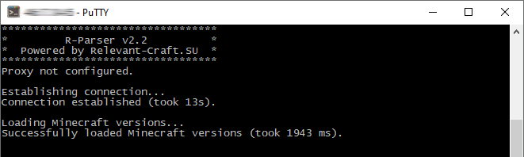

# R-Parser
R-Parser is a server application that parses resource packs, mods, maps and modpacks from curseforge.com for [R-Launcher](https://github.com/VENTO-off/R_Launcher).

## Features
The main features of R-Parser:
- parses resource packs, mods, maps and modpacks
- bypasses CloudFlare JavaScript challenge
- connects via proxy
- translates via Google Translate API / Yandex Translate API
- stores parsed data in JSON
- uploads parsed data via FTP

## Technologies
- Java 8

## Screenshots

## License
The launcher is licensed under the GNU General Public License v3.0.
